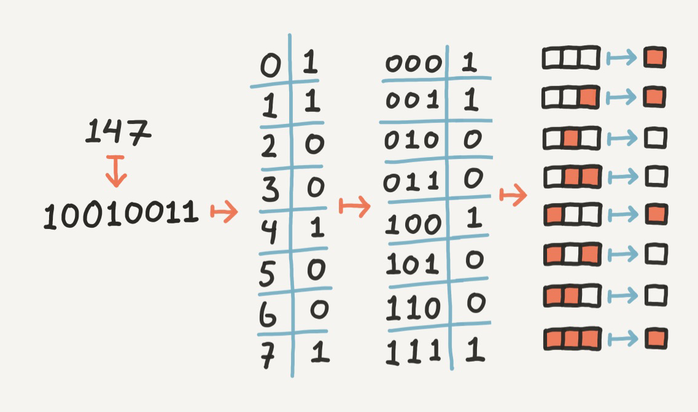
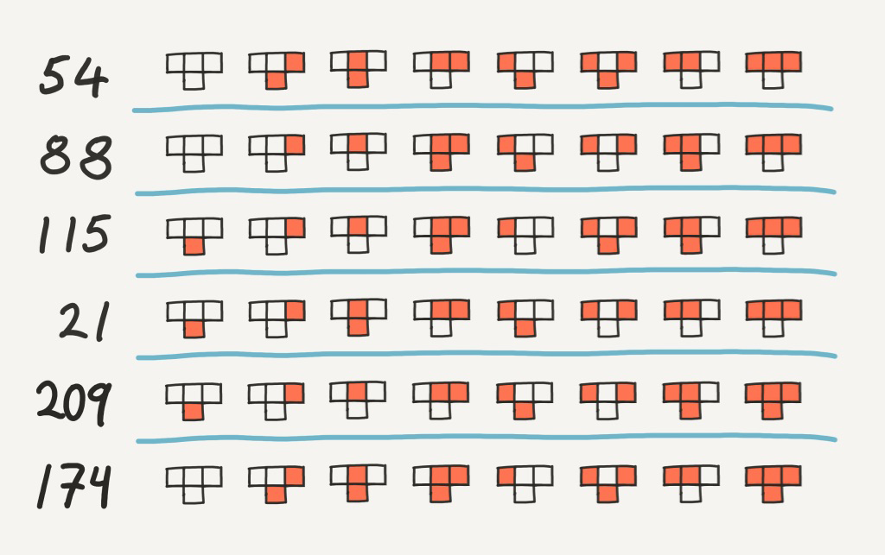

A cellular automaton is a system consisting of cells of numerical values on a grid, together with a rule that decides the behaviour of these cells. Applying this rule repeatedly on each cell on the grid, while visualizing the the grid in some way or another, often gives the effect of some evolving organism with complex and intricate behavior, even with relatively simple rules.

Cellular automata comes in many shapes, forms and dimensions. Perhaps the most famous cellular automaton is called _Game of Life_ (GOL). It consists of a two-dimensional grid where each cell contain a boolean value (dead or alive). The accompanying rule decides whether or not a cell should be dead or alive based on that cell's neighbouring cells. It states that a live cell dies of loneliness if there are less than 2 live cells around it. Similarly, it dies of overcrowding if more than three neighbouring cells are alive. In other words, a cell will only "survive" by having exactly 2 or 3 neigbouring cells that are alive. For a _dead_ cell to become alive, it needs to have exactly 3 live neighbouring cells, otherwise it stays dead.

Another famous cellular automaton variant is a one-dimensional one and called the _Elementary Cellular Automaton_ (ECA). This is the one we will be implementing in this post. Each state of this automaton is stored as a one-dimensional boolean array, and while GOL requires two dimensions to visualize its state, this automaton only requires a single line of values. Because of this, we can use two dimensions to visualize the whole state-history of this automaton. As with GOL, the state of a cell in this automaton is either 0 or 1, but while a cell in GOL is updated based on its 8 neighbours, ECA has its cell updated based on its left neighbour, its right neighbour and itself! You can see an example of a rule below, with the three top cells being the input of the rule, and the single bottom cell being the output, black being 1, white being 0.

You might wonder why the above rule is named "Rule 30". This is because each number between 0 and 255 directly corresponds to a ECA rule. The correspondence is shown below:

